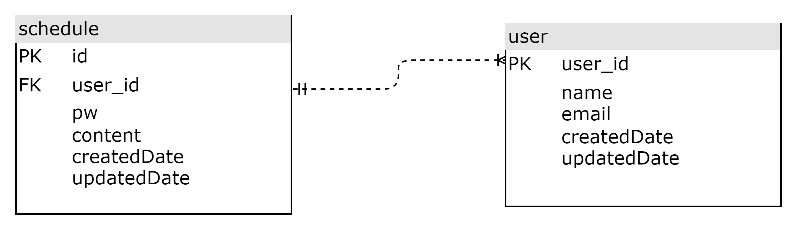

## API 명세서 

| 기능                | Method | URL                                            | request        | response  | 상태코드        |
|-------------------|--------|------------------------------------------------|----------------|-----------|-------------|
| 일정 등록             | POST   | /schedules                                     | 요청 body        | 등록 정보     | 201 CREATED |
| 일정 전체 조회          | GET    | /schedules                                     | 요청 param       | 다건 응답 정보  | 200 OK      |
| 일정 id로 조회         | GET    | /schedules/{id}                                | 요청 param       | 단건 응답 정보  | 200 OK      |
| 일정 이름 or 수정날짜로 조회 | GET    | /schedules/search?name=iamgroot&date=2025-05-14 | 요청 param       | 다건 응답 정보  | 200 OK      |
| 유저 id로 일정 조회      | GET    | /users/search/by-user?userId=1                 | 요청 param       | 다건 응답 정보  | 200 OK      |
| 일정 id로 수정         | PUT    | /schedules/{id}                                | 요청 body, param | 수정 정보     | 200 OK      |
| 일정 id로 삭제         | DELETE | /schedules/{id}                                | 요청 param       | -         | 200 OK      |
| 유저 등록             | POST   | /users                                         | 요청 body        | 등록 정보     | 201 CREATED |

##  ERD 

